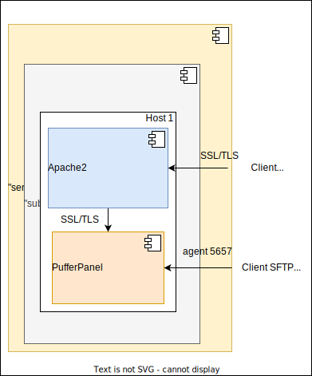

# Ansible playbook: labocbz.deploy_pufferpanel


## Description


An Ansible playbook to deploy and configure a PufferPanel server on your hosts.

This Ansible playbook streamlines the deployment of a comprehensive environment by installing PufferPanel alongside Docker, Watchtower, Portainer, Apache2 with a Web Application Firewall (WAF), Quality of Service (QOS), and other security tools. The playbook is designed to download SSL certificates from remote sources or a local path, placing them in the appropriate service locations.

Apache2 is configured to provide SSL/TLS access to the PufferPanel Web UI. Iptables is set up to block traffic on PufferPanel web ports, directing clients to use Apache2 for accessing services.

Simplify the deployment of a secure environment with this Ansible playbook, ensuring encrypted access to the PufferPanel Web UI through Apache2 while incorporating various security measures. Easily customize SSL configurations and leverage additional tools with this automated playbook.

After the install, you need to create your first Admin user. This command will help you to perform this action; don't forget to change the container's name in the command by yours.

```SHELL
docker exec -it pufferpanel /pufferpanel/pufferpanel user add
# and follow inputs
```

## Deployment diagramm



This diagram illustrates a potential deployment scenario using the provided playbook. In this configuration, Apache2 is chosen to serve as the TLS/SSL front server for PufferPanel. Both Apache2 and PufferPanel reside on the same machine, allowing seamless communication between them. PufferPanel exposes a port for SFTP connections to game servers.

Apache2 is installed as a package, while PufferPanel is deployed as a container. The latter has access to the Docker socket, enabling the creation of additional containers for your game servers. iptables is configured to block traffic to PufferPanel's web port, compelling all traffic to pass through Apache2.

## Tests and simulations

### Basics

You have to run multiples tests. *tests with an # are mandatory*

```MARKDOWN
# syntax
# converge
# idempotence
# verify
side_effect
```

Executing theses test in this order is called a "scenario" and Molecule can handle them.

Molecule use Ansible and pre configured playbook to create containers, prepare them, converge (run the playbook) and verify its execution.
You can manage multiples scenario with multiples tests in order to get a 100% code coverage.

This playbook contains a ./tests folder. In this folder you can use the inventory or the tower folder to create a simualtion of a real inventory and a real AWX / Tower job execution.

### Command reminder

```SHELL
# Check your YAML syntax
yamllint -c ./.yamllint .

# Check your Ansible syntax and code security
ansible-lint --config=./.ansible-lint .

# Execute and test your playbook
molecule create
molecule list
molecule converge
molecule verify
molecule destroy

# Execute all previous task in one single command
molecule test
```

## Installation

To install this playbook, just copy/import this playbook or raw file into your fresh playbook repository or call it with the "include_playbook/import_playbook" module.

## Usage

### Vars

```YAML
# From inventory
---
# all vars from to put/from your inventory
# see tests/inventory/group_var for all groups and vars.
```

```YAML
# From AWX / Tower
---

```

## Architectural Decisions Records

Here you can put your change to keep a trace of your work and decisions.

### 2024-01-16: First Init

* First init of this playbook with the bootstrap_playbook playbook by Lord Robin Crombez
* Playbook install and configure Docker, Portainer can be installed to
* Playbook install and configure Apache2 and handle SSL/TLS deployment (not the creation)
* PufferPanel server installed and configured
* Iptables rules added to disable remote access (Web UI)

### 2024-01-17: Schema and adduser command

* Added deployment schema
* Added create user admin for first launch

### 2024-03-02: Fix and CI

* Added support for new CI base
* Edit all vars with __
* Tested and validated on Docker

### 2024-05-19: New CI

* Added Markdown lint to the CICD
* Rework all Docker images
* Change CICD vars convention
* New workers
* Removed all automation based on branch

## Authors

* Lord Robin Crombez

## Sources

* [Ansible playbook documentation](https://docs.ansible.com/ansible/latest/playbook_guide/playbooks_reuse_playbooks.html)
* [Ansible Molecule documentation](https://molecule.readthedocs.io/)
* [labocbz.prepare_host](https://github.com/CBZ-D-velop/Ansible-Role-Labocbz-Prepare-Host.git)
* [labocbz.add_certificates](https://github.com/CBZ-D-velop/Ansible-Role-Labocbz-Add-Certificates.git)
* [labocbz.install_docker](https://github.com/CBZ-D-velop/Ansible-Role-Labocbz-Install-Docker.git)
* [labocbz.install_apache](https://github.com/CBZ-D-velop/Ansible-Role-Labocbz-Install-Apache.git)
* [labocbz.add_apache_confs](https://github.com/CBZ-D-velop/Ansible-Role-Labocbz-Add-Apache-Confs.git)
* [labocbz.add_logrotate_confs](https://github.com/CBZ-D-velop/Ansible-Role-Labocbz-Add-Logrotate-Confs.git)
* [labocbz.install_pufferpanel](https://github.com/CBZ-D-velop/Ansible-Role-Labocbz-Install-PufferPanel.git)
